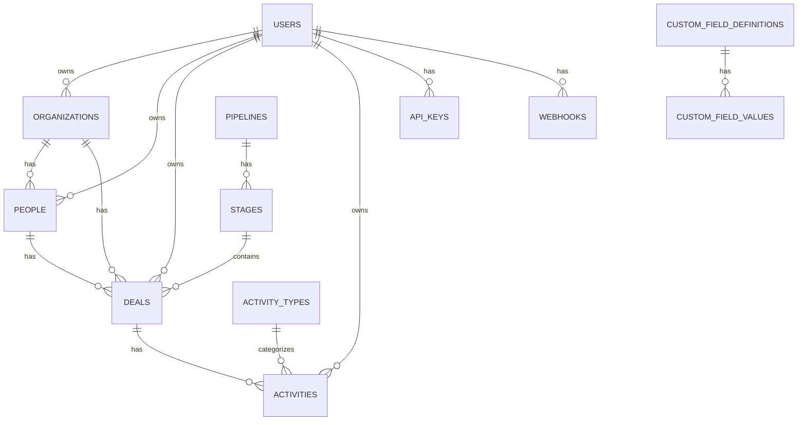

# Database Schema

This document provides a comprehensive overview of CRM Norr Energia's database architecture, entity relationships, and table structures.

## Overview

CRM Norr Energia uses **PostgreSQL** for its primary data store, managed through **Drizzle ORM** with migrations stored in the `drizzle/` directory. This guide covers the schema structure, common patterns, and how to work with migrations.

## Entity Relationships



## Schema Files

| File | Contents |
|------|---------|
| `users.ts` | User accounts, roles, locale/timezone preferences |
| `organizations.ts` | Company records |
| `people.ts` | Contact records |
| `deals.ts` | Deal records |
| `activities.ts` | Activity records |
| `activity-types.ts` | Activity type definitions |
| `pipelines.ts` | Pipeline and stage definitions |
| `custom-fields.ts` | Custom field definitions |
| `_relations.ts` | Entity relationship definitions |
| `api-keys.ts` | API key management |
| `webhooks.ts` | Webhook configuration |
| `domain-whitelist.ts` | Email domain whitelist for signups |
| `rejected-signups.ts` | Rejected signup records |
| `verification-tokens.ts` | Email verification tokens |
| `sessions.ts`, `accounts.ts` | Auth.js session/account storage |

## Core Tables

### users

| Column | Type | Description |
|--------|------|-------------|
| `id` | TEXT (UUID) | Primary key |
| `email` | TEXT | Unique email address |
| `email_verified` | TIMESTAMP | Email verification timestamp |
| `name` | TEXT | Display name |
| `password_hash` | TEXT | Hashed password (argon2) |
| `role` | ENUM('admin', 'member') | User role |
| `status` | ENUM | Account status (pending_verification, pending_approval, approved, rejected) |
| `locale` | TEXT | User's locale preference (default: 'en-US') |
| `timezone` | TEXT | User's timezone (default: 'America/New_York') |
| `deleted_at` | TIMESTAMP | Soft delete timestamp |

**Indexes:**
- `email` (unique)

### organizations

| Column | Type | Description |
|--------|------|-------------|
| `id` | TEXT (UUID) | Primary key |
| `name` | TEXT | Organization name |
| `website` | TEXT | Optional website URL |
| `industry` | TEXT | Optional industry classification |
| `notes` | TEXT | Additional notes |
| `owner_id` | TEXT (FK) | User who created this organization |
| `custom_fields` | JSONB | Custom field values |
| `deleted_at` | TIMESTAMP | Soft delete timestamp |

### Common Patterns

#### Ownership Pattern

All core entities have an `owner_id` foreign key referencing `users.id`. This establishes who created the entity and tracks ownership.

#### Soft Delete Pattern

Entities use a `deleted_at` timestamp instead of hard deletes. Set `deleted_at` to NULL to restore. Filter with `WHERE deleted_at IS NULL` to exclude soft-deleted records.

#### Custom Fields Pattern

Custom fields are stored in `custom_fields` JSONB columns on each entity. This allows flexible, user-defined fields without schema changes:

```sql
custom_fields JSONB DEFAULT '{}'
-- Flexible storage for user-defined fields
```

#### Gap-based Positioning

Used for ordering deals in kanban columns, stages in pipelines, and custom fields in forms. Numeric `position` field allows reordering without full renumbering:

```sql
position REAL  -- Numeric for flexible ordering
-- New items: MAX(position) + 10000
-- Reorder: average of neighbors
```

### people

| Column | Type | Description |
|--------|------|-------------|
| `id` | TEXT (UUID) | Primary key |
| `first_name` | TEXT | Contact's first name |
| `last_name` | TEXT | Contact's last name |
| `email` | TEXT | Optional email address |
| `phone` | TEXT | Optional phone number |
| `organization_id` | TEXT (FK) | Associated organization (nullable) |
| `owner_id` | TEXT (FK) | User who created this person |
| `custom_fields` | JSONB | Custom field values |
| `deleted_at` | TIMESTAMP | Soft delete timestamp |

### deals

| Column | Type | Description |
|--------|------|-------------|
| `id` | TEXT (UUID) | Primary key |
| `title` | TEXT | Deal title |
| `value` | NUMERIC | Deal value (nullable for "No Value" deals) |
| `stage_id` | TEXT (FK) | Current pipeline stage |
| `organization_id` | TEXT (FK) | Associated organization (nullable) |
| `person_id` | TEXT (FK) | Associated person (nullable) |
| `owner_id` | TEXT (FK) | User who created this deal |
| `position` | NUMERIC | Position in kanban column |
| `expected_close_date` | TIMESTAMP | Expected close date |
| `custom_fields` | JSONB | Custom field values |
| `deleted_at` | TIMESTAMP | Soft delete timestamp |

### activities

| Column | Type | Description |
|--------|------|-------------|
| `id` | TEXT (UUID) | Primary key |
| `title` | TEXT | Activity title |
| `type_id` | TEXT (FK) | Activity type (call, meeting, task, email) |
| `deal_id` | TEXT (FK) | Associated deal (nullable) |
| `owner_id` | TEXT (FK) | User who created this activity |
| `due_date` | TIMESTAMP | Due date |
| `completed_at` | TIMESTAMP | Completion timestamp (null = not done) |
| `custom_fields` | JSONB | Custom field values |
| `deleted_at` | TIMESTAMP | Soft delete timestamp |

### Relationships

- **Organization -> People**: One organization can have many people
- **Organization -> Deals**: One organization can have many deals
- **Person -> Deals**: One person can have many deals
- **Pipeline -> Stages**: One pipeline has multiple stages
- **Stage -> Deals**: One stage contains multiple deals
- **Deal -> Activities**: One deal can have many activities
- **User -> Everything**: Users own the organizations, people, deals, and activities they create

## Migrations

Database migrations are managed through Drizzle Kit:

### Running Migrations

```bash
# Apply pending migrations
npx drizzle-kit migrate

# Generate new migration from schema changes
npx drizzle-kit generate
```

### Migration Files

- Located in `drizzle/` directory
- Named with timestamp: `0000_migration_name.sql`
- **Never edit database directly** - always use migrations

### Best Practices

- **Always use migrations** for schema changes
- **Test migrations on a staging database before production**
- **Backup database before running migrations in production**
- **Use transactions for multi-step operations**

## Next Steps

- Review the [Contributing Guide](./contributing.md) for development workflow
- See the [Code Style Guide](./code-style.md) for coding conventions
- See the [Testing Guide](./testing.md) for testing instructions

---

*Last updated: 2026-03-04*
