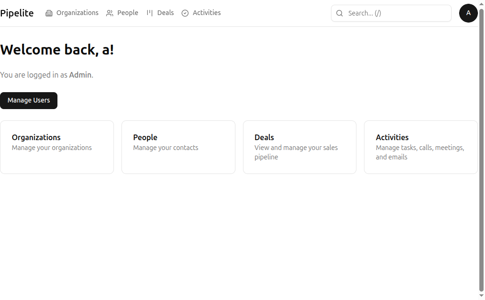
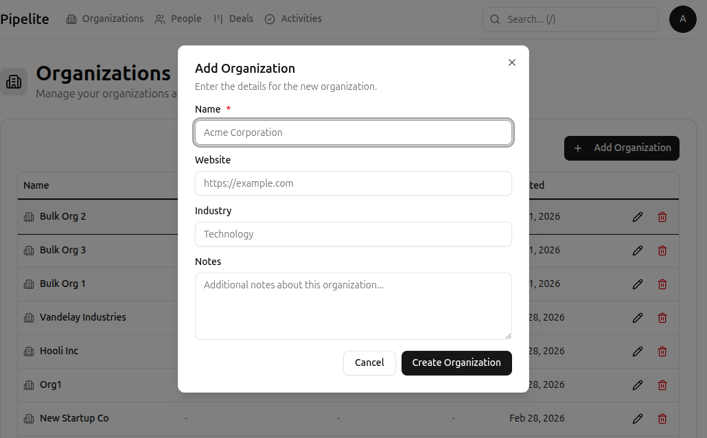
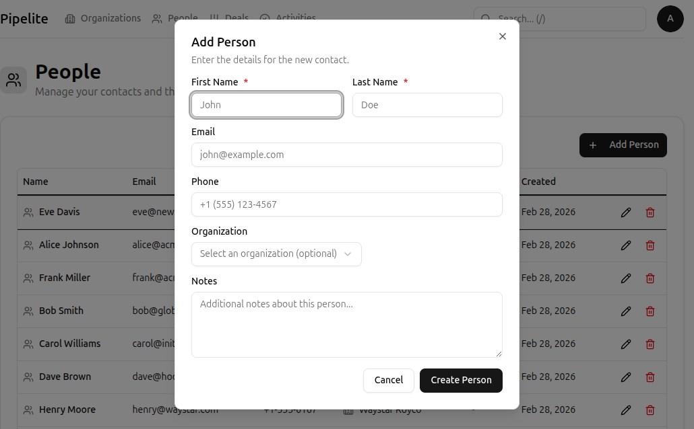
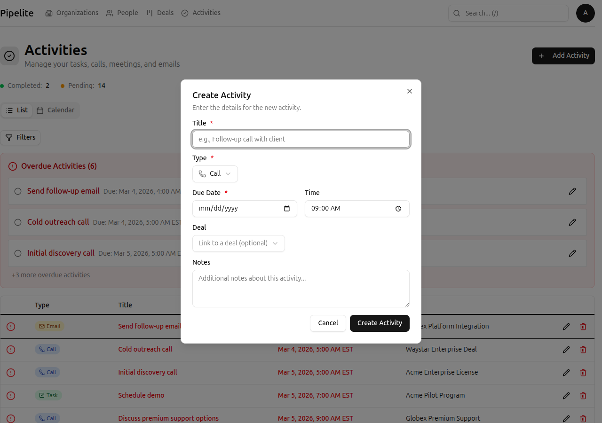
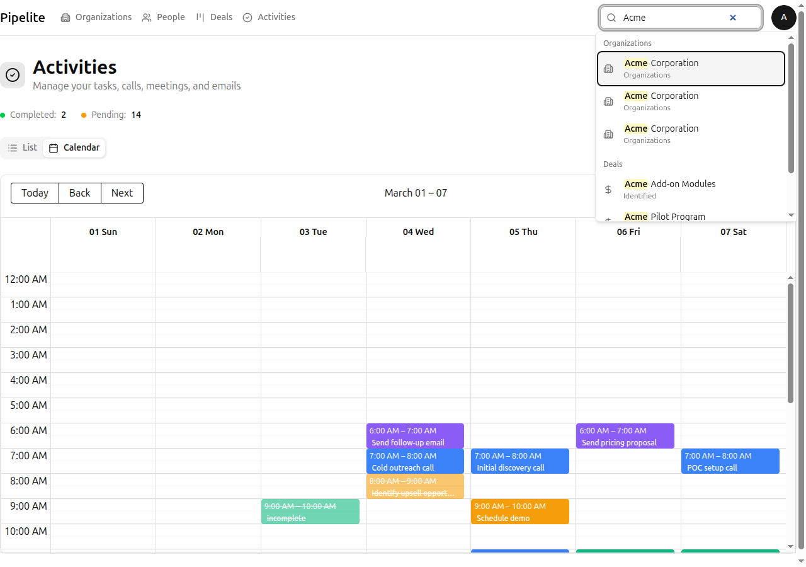

# Getting Started with CRM Norr Energia

Welcome to CRM Norr Energia! This tutorial will guide you through the core features and help you understand how to use the application effectively.

## What You'll Learn

By the end of this tutorial, you will be able to:

- Navigate the main interface and understand the layout
- Create and manage organizations
- Add people (contacts) to organizations
- Create deals in pipelines
- Track follow-ups with activities
- Use keyboard shortcuts for faster navigation

## Prerequisites

Before starting, make sure you have:

- A CRM Norr Energia account with approved access
- Successfully logged in to the application

> **Note:** If you don't have an account yet, contact your administrator to create and approve your account.

---

## Step 1: Navigate the Interface

When you first log in, you'll see the main navigation header at the top of the screen and a dashboard showing your key metrics.

### Main Navigation

The navigation bar provides quick access to all main sections:

| Navigation Item | What It Does |
|----------------|--------------|
| **Home** | Dashboard with overview metrics |
| **Organizations** | Manage companies and accounts |
| **People** | Manage contacts and individuals |
| **Deals** | View and manage your sales pipeline |
| **Activities** | Track tasks, calls, meetings, and emails |

### Keyboard Shortcuts

You can quickly navigate using keyboard shortcuts:

- Press `Alt + 1` for Home
- Press `Alt + 2` for Organizations
- Press `Alt + 3` for People
- Press `Alt + 4` for Deals
- Press `?` to see all available shortcuts

**Expected outcome:** You should see the main dashboard with navigation options at the top.

---

## Step 2: Create Your First Organization

Organizations represent companies or accounts you work with.

1. Click **Organizations** in the navigation bar (or press `Alt + 2`)
2. Click the **New Organization** button in the top right
3. Enter the organization name (e.g., "Acme Corporation")
4. Optionally add notes about the organization
5. Click **Create** to save

**Expected outcome:** The organization appears in the list and you can click it to view details.

---

## Step 3: Add a Person to the Organization

People are individual contacts that can be associated with organizations.

1. Click **People** in the navigation bar (or press `Alt + 3`)
2. Click the **New Person** button
3. Fill in the contact details:
   - **First Name** (required): e.g., "John"
   - **Last Name** (required): e.g., "Smith"
   - **Email**: e.g., "john.smith@acme.com"
   - **Phone**: e.g., "+1 (555) 123-4567"
   - **Organization**: Select "Acme Corporation" from the dropdown
4. Click **Create** to save

**Expected outcome:** The person appears in your contacts list and is linked to the organization.

---

## Step 4: Create a Deal in a Pipeline

Deals represent sales opportunities that move through your pipeline stages.

1. Click **Deals** in the navigation bar (or press `Alt + 4`)
2. Click the **New Deal** button
3. Fill in the deal details:
   - **Title** (required): e.g., "Acme Enterprise License"
   - **Value**: e.g., "50000"
   - **Organization**: Select "Acme Corporation"
   - **Person**: Select "John Smith"
   - **Pipeline**: Select your default pipeline
   - **Stage**: The first stage should be pre-selected
4. Click **Create** to save

**Expected outcome:** The deal appears in your pipeline's Kanban board in the first stage.

### Moving Deals Between Stages

In the Kanban view:

1. **Click and drag** a deal card to move it between stages
2. The deal's stage updates immediately
3. All changes are saved automatically

---

## Step 5: Add an Activity to Follow Up

Activities help you track tasks, calls, meetings, and emails related to your deals.

1. Click **Activities** in the navigation bar
2. Click the **New Activity** button
3. Fill in the activity details:
   - **Type**: Choose from Call, Meeting, Task, or Email
   - **Title** (required): e.g., "Follow up on proposal"
   - **Due Date**: Select when you need to complete this
   - **Due Time**: Optionally set a specific time
   - **Deal**: Link to "Acme Enterprise License" (optional)
   - **Notes**: Add any relevant details
4. Click **Create** to save

**Expected outcome:** The activity appears in your activities list and will show as overdue if the due date passes.

### Marking Activities Complete

1. Find the activity in your list
2. Click the **checkbox** next to the activity title
3. The activity will be marked as completed and moved to the completed section

---

## Step 6: Use Global Search

The global search lets you quickly find organizations, people, and deals.

1. Press `/` (forward slash) to focus the search bar
   - Or click the search icon in the navigation header
2. Type your search query
3. Results are grouped by type (Organizations, People, Deals)
4. Click a result to navigate directly to that item

**Expected outcome:** Matching results appear instantly as you type.

---

## Next Steps

Now that you understand the basics, explore these tutorials to learn more:

- [Create and Manage Your First Deal](./tutorials/create-first-deal.md) — Deep dive into deal management
- [Manage Activities and Follow-ups](./tutorials/manage-activities.md) — Master your task tracking
- [Using Custom Fields](./tutorials/use-custom-fields.md) — Add custom data to your records

### Reference Documentation

For comprehensive feature information, check out the reference docs:

- [Organizations Reference](./reference/organizations.md)
- [People Reference](./reference/people.md)
- [Deals Reference](./reference/deals.md)
- [Activities Reference](./reference/activities.md)
- [Keyboard Shortcuts Reference](./reference/keyboard-shortcuts.md)

---

*Last updated: 2026-03-04*
