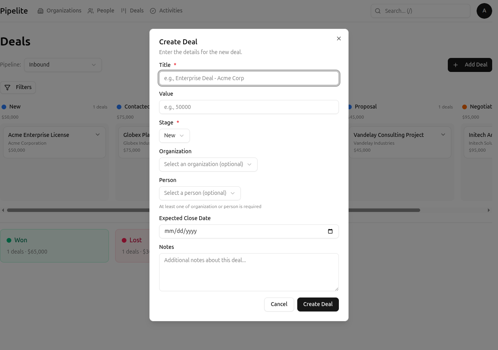
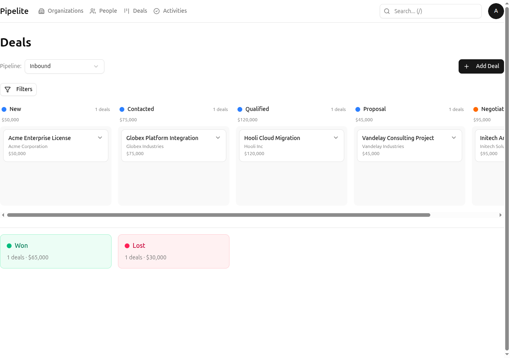
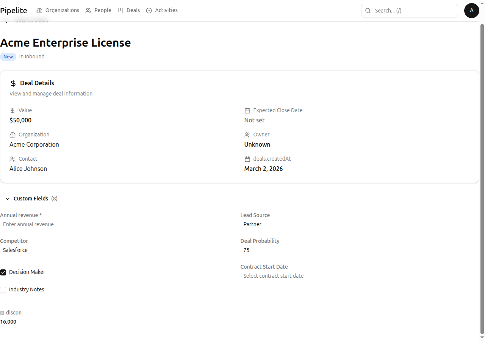

# Create and Manage Your First Deal

This tutorial guides you through creating your first deal in CRM Norr Energia, moving it through the pipeline stages, and understanding the kanban board interface.

## What You'll Learn

- How to create a new deal with all required details
- How to view and navigate deals on the kanban board
- How to drag and drop deals between stages
- How to view and edit deal details
- How to link activities to deals

## Prerequisites

- You're logged in to CRM Norr Energia
- At least one [organization has been created](../getting-started.md#step-2-create-your-first-organization)
- A pipeline exists in your account (created during setup or by an administrator)

---

## Step 1: Navigate to the Deals Page

1. Click **Deals** in the navigation bar (or press `Alt + 4`)
2. You'll see the kanban board view with your pipeline's stages as columns
3. Each column shows deals in that stage

**Expected outcome:** You see a kanban board with stages as columns. If no deals exist yet, the board will be empty.

---

## Step 2: Create a New Deal

1. Click the **New Deal** button in the top right of the page
2. Fill in the deal details:
   - **Title**: A descriptive name for the deal (e.g., "Acme Corp - Enterprise License")
   - **Value**: The potential deal value
   - **Organization**: Select an existing organization (required)
   - **Person**: Optionally select a contact person
   - **Stage**: Select which stage the deal should start in
   - **Expected Close Date**: When you expect to close this deal (optional)
   - **Notes**: Any additional information

3. Click **Create Deal** to save

**Expected outcome:** The deal appears on the kanban board in the selected stage.

---

## Step 3: View Deals on the Kanban Board

The kanban board provides a visual overview of all your deals:

1. Each **column** represents a stage in your pipeline
2. Each **card** represents a deal
3. Deal cards show:
   - Deal title
   - Organization name
   - Deal value
   - Contact person (if linked)

### Navigating the Kanban

- **Scroll horizontally** to see all stages
- **Scroll vertically** within a stage if many deals exist
- **Click a deal card** to view details
- **Use keyboard shortcuts** for faster navigation:
  - `h/l` to move between stages (columns)
  - `j/k` to move between deals within a stage
  - `Enter` to open selected deal

---

## Step 4: Move Deals Between Stages

### Using Drag and Drop

1. Click and hold on a deal card
2. Drag it to the desired stage column
3. Release to drop the deal in the new stage
4. The deal's position is saved automatically

### Using Keyboard Shortcuts

1. Select a deal using `j/k` keys
2. Press `h` or `l` to move to adjacent stages
3. Press `Enter` to confirm the move

**Note:** Won and Lost stages are special terminal stages. Deals moved there are considered closed.

---

## Step 5: View and Edit Deal Details

1. Click on any deal card to open the detail panel
2. The detail view shows:
   - All deal information
   - Linked organization and person
   - Associated activities
   - Custom fields (if configured)

### Editing Deal Information

1. Click the **Edit** button in the detail panel
2. Modify any fields as needed
3. Click **Save Changes** to update

---

## Step 6: Link an Activity to the Deal

Activities help you track follow-ups and next steps for a deal:

1. From the deal detail view, find the **Activities** section
2. Click **Add Activity**
3. Fill in the activity details:
   - **Type**: Call, Meeting, Task, or Email
   - **Title**: What the activity is about
   - **Due Date**: When to complete it
   - **Notes**: Details about the activity
4. The activity is automatically linked to this deal

**Expected outcome:** The activity appears in the deal's activity list and on the main Activities page.

---

## Tips for Managing Deals

### Best Practices

- **Keep deal titles descriptive** — Include company name and opportunity type
- **Update values as deals progress** — More accurate forecasting
- **Always link to organizations** — Maintains data relationships
- **Use activities for follow-ups** — Never lose track of next steps

### Pipeline Navigation Shortcuts

| Shortcut | Action |
|----------|--------|
| `h` | Move selection left (previous stage) |
| `l` | Move selection right (next stage) |
| `j` | Move selection down (next deal in stage) |
| `k` | Move selection up (previous deal in stage) |
| `Enter` | Open selected deal |
| `n` | Create new deal |
| `e` | Edit selected deal |

---

## Next Steps

- Learn more about deal fields in the [Deals Reference](../reference/deals.md)
- Master [activity management](./manage-activities.md) for comprehensive follow-up tracking
- Explore [pipelines and kanban features](../reference/pipelines-kanban.md)
- Set up [custom fields](./use-custom-fields.md) for deal-specific data

---

*Last updated: 2026-03-04*
