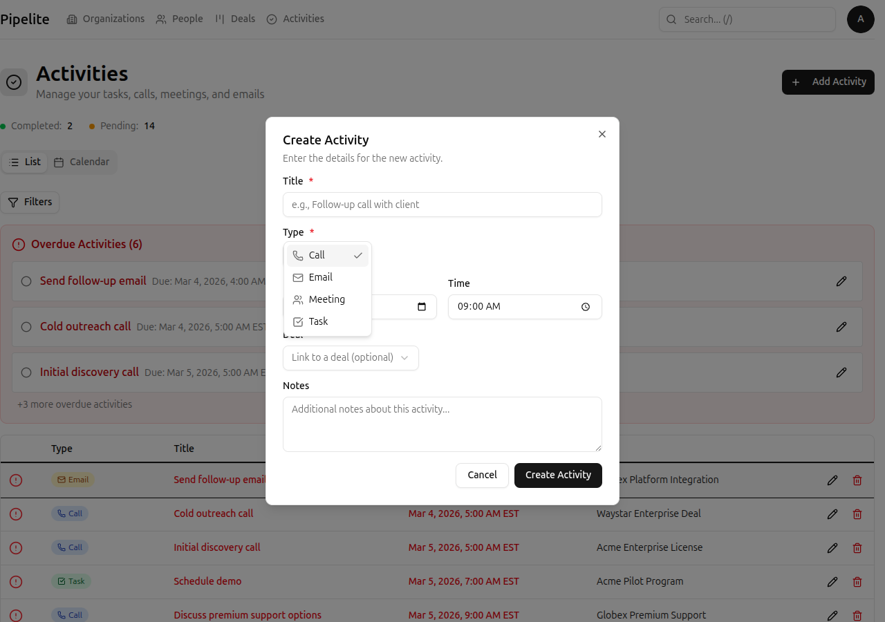
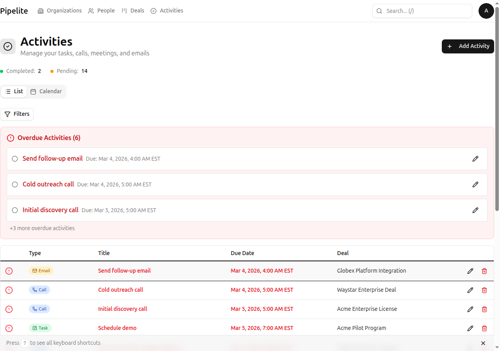
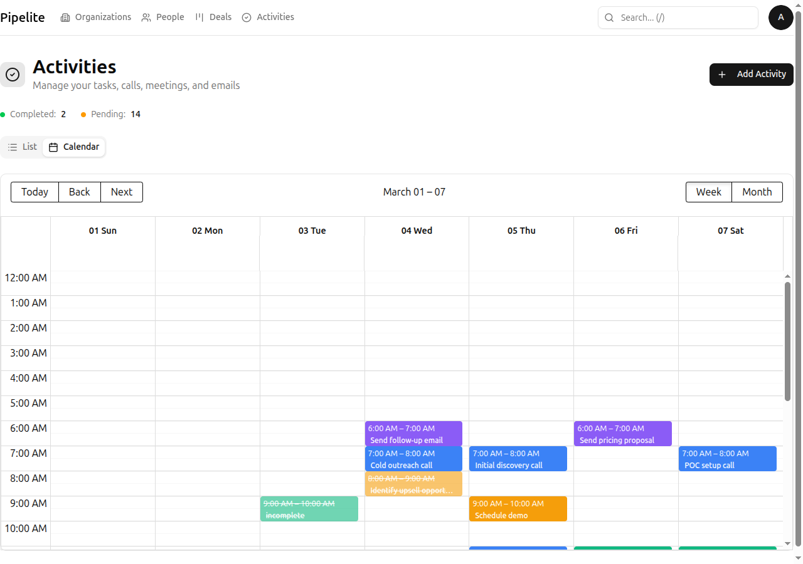

# Manage Activities and Follow-ups

This tutorial shows you how to create, track, and complete activities in CRM Norr Energia to ensure you never miss a follow-up.

## What You'll Learn

- How to create different activity types (calls, meetings, tasks, emails)
- How to set due dates and track completion
- How to view activities in list and calendar views
- How to link activities to deals
- How to filter activities by type and date

## Prerequisites

- You're logged in to CRM Norr Energia
- (Optional) A deal exists for linking activities

---

## Step 1: Navigate to the Activities Page

1. Click **Activities** in the navigation bar (or press `Alt + 5` if available, or navigate via menu)
2. You'll see the activities list view by default
3. The view shows all your scheduled and completed activities

**Expected outcome:** You see the activities page with any existing activities or an empty state if none exist yet.

---

## Step 2: Create a New Activity

1. Click the **New Activity** button
2. Select an activity type:
   - **Call** — Phone conversations
   - **Meeting** — In-person or video meetings
   - **Task** — To-do items and action items
   - **Email** — Email follow-ups

3. Fill in the activity details:
   - **Title**: What the activity is about (e.g., "Follow up on proposal")
   - **Due Date**: When this needs to be completed
   - **Due Time**: Specific time (useful for meetings and calls)
   - **Deal**: Optionally link to a deal
   - **Notes**: Details, agenda items, or context

4. Click **Create Activity** to save

**Expected outcome:** The activity appears in your activities list with the scheduled date.

---

## Step 3: Set Due Dates and Times

Due dates help you prioritize your work:

### Setting Dates

1. Click the date field in the activity form
2. Select the due date from the calendar picker
3. The date is displayed in your local format

### Setting Times

1. Click the time field
2. Select hour and minute
3. Times are displayed in your local timezone

### Overdue Activities

Activities past their due date are:
- Highlighted in red in the list view
- Shown in a special "Overdue" section at the top
- Display relative time (e.g., "2 days overdue")

---

## Step 4: Link Activities to Deals

Linking activities to deals keeps everything organized:

1. When creating or editing an activity, find the **Deal** field
2. Click to open the deal selector
3. Search for a deal by title or organization name
4. Select the deal to link

**Benefits of linking:**
- Activity appears on the deal's detail view
- Easy to see all follow-ups for a specific deal
- Completed activities show deal progress

---

## Step 5: Mark Activities as Complete

### From the List View

1. Find the activity you want to complete
2. Click the **checkbox** or **Complete** button
3. The activity is marked as done with a completion timestamp

### From the Deal View

1. Open a deal's detail panel
2. Find the activity in the Activities section
3. Click **Mark Complete**

**Expected outcome:** The activity shows a completion date and moves to the completed section.

---

## Step 6: View Activities in Calendar View

The calendar view gives a visual timeline of your scheduled activities:

1. Click the **Calendar** tab at the top of the activities page
2. Activities appear as events on their due dates
3. Different colors indicate different activity types

### Calendar Navigation

- **Click arrows** to move between weeks
- **Click "Today"** to jump to current date
- **Click an activity** to view details
- **Week view** shows 7 days at a time

### Activity Colors

| Type | Color |
|------|-------|
| Call | Blue |
| Meeting | Green |
| Task | Yellow |
| Email | Purple |

---

## Step 7: Filter Activities

### Filter by Type

1. Use the **Type** dropdown to select:
   - All types
   - Calls only
   - Meetings only
   - Tasks only
   - Emails only

### Filter by Date Range

1. Use the date filters to show:
   - Overdue activities
   - Today's activities
   - This week's activities
   - Custom date range

### Filter by Completion Status

1. Toggle between:
   - **Pending** — Activities not yet completed
   - **Completed** — Finished activities
   - **All** — Everything

**Note:** Filter settings are saved in the URL, so you can share filtered views with team members.

---

## Tips for Activity Management

### Best Practices

- **Create activities immediately** — Don't rely on memory for follow-ups
- **Be specific with titles** — "Call John about pricing" is better than "Follow up"
- **Set realistic due dates** — Helps with accurate pipeline forecasting
- **Link to deals when relevant** — Maintains context and history
- **Complete activities when done** — Keeps your pipeline accurate

### Keyboard Shortcuts

| Shortcut | Action |
|----------|--------|
| `j` | Move to next activity |
| `k` | Move to previous activity |
| `Enter` | Open selected activity |
| `n` | Create new activity |
| `e` | Edit selected activity |
| `d` | Delete selected activity |

---

## Common Activity Workflows

### For a New Lead

1. Create a **Call** activity to make first contact
2. After the call, create a **Meeting** activity for a demo
3. Follow up with an **Email** sending materials
4. Create **Task** items for internal preparation

### For Deal Progress

1. Create activities for each milestone
2. Link all activities to the deal
3. Set due dates aligned with expected close date
4. Mark complete as you progress

---

## Next Steps

- Learn about all activity fields in the [Activities Reference](../reference/activities.md)
- Understand [deals](./create-first-deal.md) and how activities connect to them
- Explore [keyboard shortcuts](../reference/keyboard-shortcuts.md) for faster navigation
- Set up [custom fields](./use-custom-fields.md) for activity-specific data

---

*Last updated: 2026-03-04*
