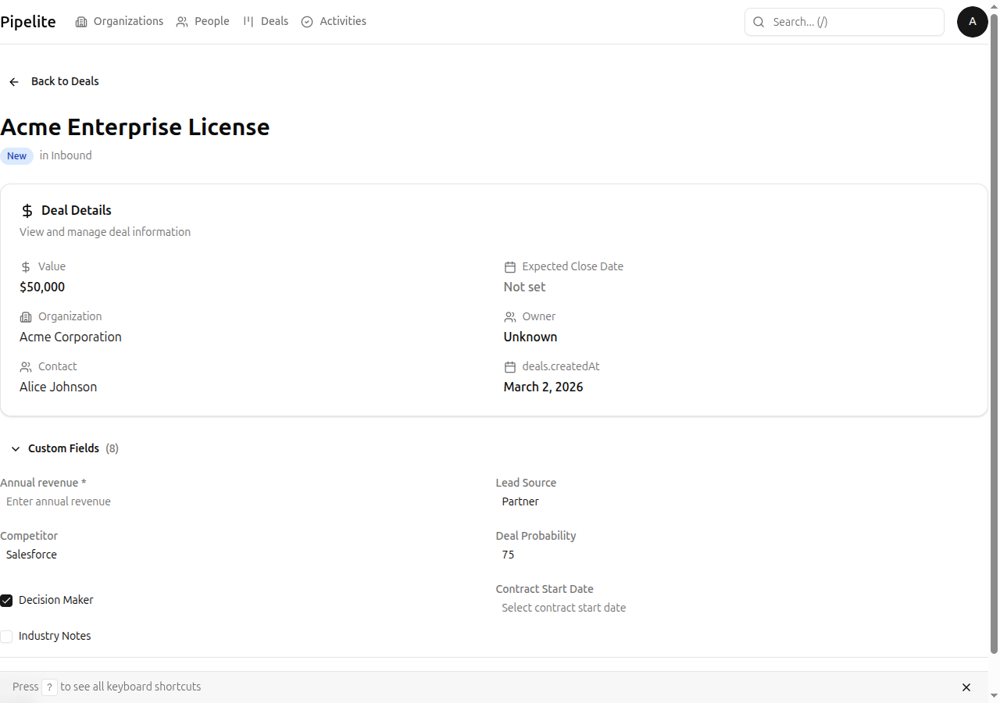
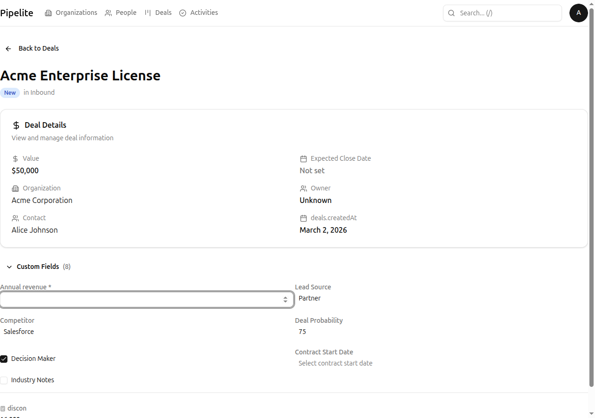
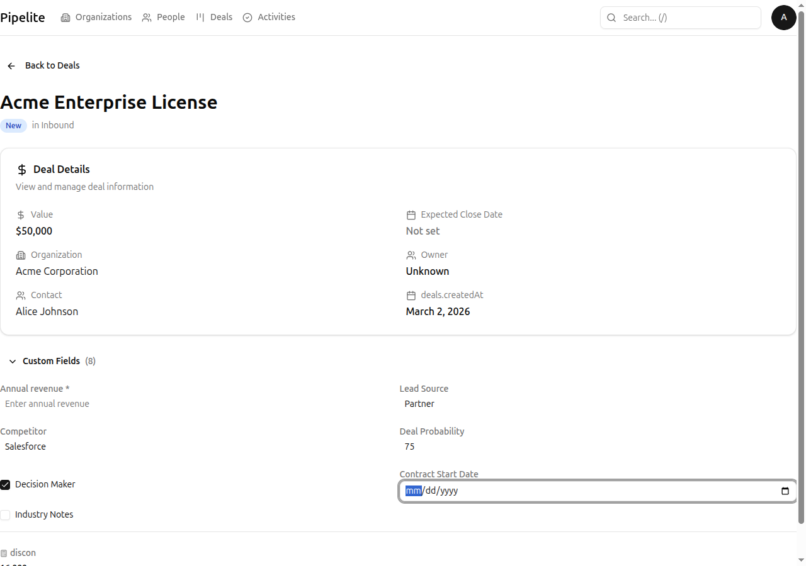
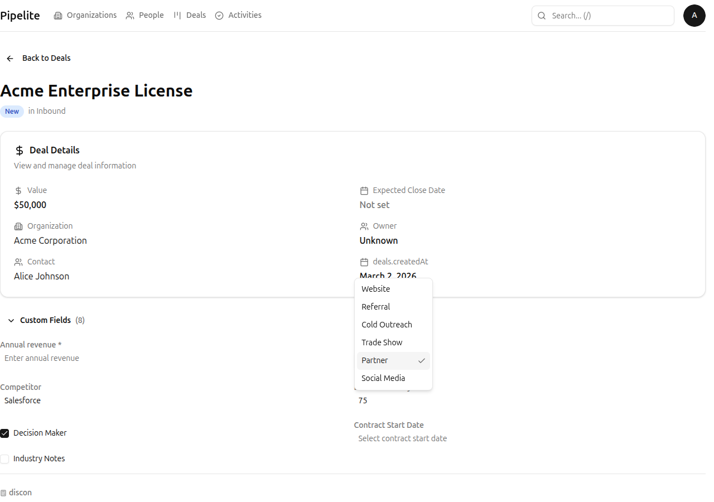
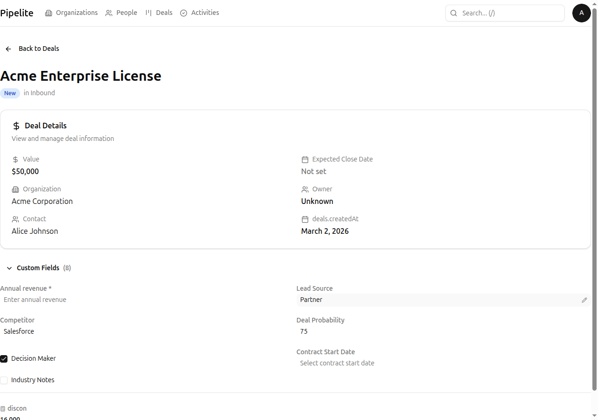

# Using Custom Fields

This tutorial explains how to view, edit, and work with custom fields that administrators have configured for your organizations, people, deals, and activities.

## What You'll Learn

- How to view custom fields on entity pages
- How to edit different field types (text, number, date, select, etc.)
- How to use file and URL fields
- How formula fields work automatically
- How to work with lookup fields

## Prerequisites

- You're logged in to CRM Norr Energia
- An administrator has created custom fields for your entities
- You have at least one organization, person, deal, or activity to work with

---

## Understanding Custom Fields

Custom fields allow your organization to track data specific to your business needs. They are created by administrators and appear on entity detail pages (organizations, people, deals, activities).

### Where to Find Custom Fields

1. Navigate to any entity detail page (e.g., open a deal)
2. Scroll to the **Custom Fields** section
3. Click the section header to expand/collapse

**Note:** If you don't see a Custom Fields section, no custom fields have been configured for that entity type yet.

---

## Step 1: Edit Text and Number Fields

Text and number fields are the simplest custom field types:

### Text Fields

1. Click on the text field value (or the placeholder text)
2. Type your new value
3. Press **Enter** or click outside to save automatically

### Number Fields

1. Click on the number field
2. Enter a numeric value
3. The field validates that only numbers are entered
4. Press **Enter** or click outside to save

**Tip:** Number fields can store decimals, percentages, or currency values depending on how they were configured.

---

## Step 2: Use Date Fields

Date fields allow you to select specific dates:

1. Click on the date field
2. A calendar picker appears
3. Navigate to the desired month/year
4. Click on the date to select
5. The date is saved in your configured format

### Clearing Dates

To clear a date field:
1. Click on the field
2. Click the **Clear** or **X** button in the picker

---

## Step 3: Use Selection Fields

Selection fields come in two types: single-select and multi-select.

### Single-Select (Dropdown)

1. Click on the dropdown
2. Select one option from the list
3. The selection is saved immediately

### Multi-Select

1. Click on the multi-select field
2. Click options to toggle them on/off
3. Selected options appear as tags
4. Click outside or press Enter to save

**Tip:** Click the **X** on a tag to remove a selected option.

---

## Step 4: Work with Boolean Fields

Boolean fields are simple on/off toggles:

1. Click the toggle switch
2. The value changes between **Yes** and **No** (or **True**/False**)
3. Changes are saved automatically

---

## Step 5: Upload Files to File Fields

File fields allow you to attach documents, images, or other files:

### Uploading a File

1. Click the **Upload** button or drag and drop a file onto the field
2. The file uploads to storage
3. The file appears in the field with its name and size

### Managing Uploaded Files

- **View**: Click the file name to download/view
- **Remove**: Click the **X** or trash icon to remove
- **Multiple files**: Some file fields allow multiple uploads
- **Reorder**: Drag files to reorder if multiple are allowed

### Supported File Types

Administrators configure which file types are allowed. Common types include:
- Documents (PDF, DOC, DOCX)
- Images (PNG, JPG, GIF)
- Spreadsheets (XLS, XLSX, CSV)

---

## Step 6: Add URLs to Link Fields

URL fields store web links:

1. Click on the URL field
2. Paste or type the URL
3. Press **Enter** to save
4. The URL becomes a clickable link

### URL Tips

- Include the full URL with `https://` prefix
- Invalid URLs will show an error message
- The field automatically adds `https://` if you forget the protocol

---

## Step 7: Use Lookup Fields

Lookup fields connect to other entities in your system:

1. Click on the lookup field
2. Search for the entity by name
3. Select from the search results
4. The linked entity's name appears in the field

### Example Use Cases

- **Organization lookup** on a deal for parent company
- **Person lookup** on an activity for primary contact
- **Deal lookup** on an activity for related opportunity

### Clearing a Lookup

Click the **X** button next to the selected value to clear the relationship.

---

## Step 8: Understand Formula Fields

Formula fields are **read-only** — they calculate automatically based on other field values:

### How Formulas Work

1. Administrators define formulas using other field values
2. The formula evaluates whenever source fields change
3. Results display automatically — you cannot edit them

### Example Formulas

| Formula | Description |
|---------|-------------|
| `{deal_value} * 0.1` | Calculate 10% commission |
| `DAYS({close_date}, TODAY())` | Days until expected close |
| `{annual_revenue} / 12` | Monthly revenue average |
| `IF({score} > 80, "Hot", "Warm")` | Lead temperature classification |

### Formula Result Types

- **Number**: Displayed with appropriate formatting
- **Text**: Shown as-is
- **Boolean**: Shown as Yes/No
- **Date**: Formatted according to your settings

**Note:** If a formula shows an error, it usually means a source field is empty or has invalid data.

---

## Custom Field Types Reference

| Type | Input Method | Use Case |
|------|--------------|----------|
| **Text** | Free text input | Names, descriptions, codes |
| **Number** | Numeric input | Quantities, amounts, scores |
| **Date** | Calendar picker | Deadlines, start dates, milestones |
| **Boolean** | Toggle switch | Yes/No flags, checkboxes |
| **Single-Select** | Dropdown menu | Status, priority, category |
| **Multi-Select** | Multi-select dropdown | Tags, multiple categories |
| **File** | File upload | Contracts, documents, images |
| **URL** | URL input | Website links, document links |
| **Lookup** | Entity search | Related records, references |
| **Formula** | Automatic calculation | Computed values, scores |

---

## Tips for Working with Custom Fields

### Best Practices

- **Fill in fields promptly** — Keeps your data complete and useful
- **Use consistent values** — Helps with filtering and reporting
- **Don't leave required fields empty** — May block certain operations
- **Check formulas after data entry** — Ensure calculations are correct

### Common Issues

| Issue | Solution |
|-------|----------|
| Field not saving | Check for validation errors (red highlight) |
| Formula shows error | Ensure all source fields have valid values |
| Can't find a field | Check if section is collapsed |
| File upload fails | Check file size and type restrictions |

---

## Next Steps

- Learn about all field types in the [Custom Fields Reference](../reference/custom-fields.md)
- Understand how custom fields are configured (if you're an admin)
- See how [search and filtering](../reference/search-filtering.md) works with custom fields
- Explore [import/export](../getting-started.md) for bulk data management

---

*Last updated: 2026-03-04*
